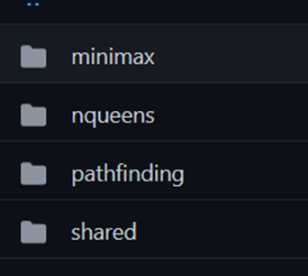

## AI Search Algorithm Visualisation

Hello! This is the documentation detailing the codebase of this project. For learning how to use the app, checkout the tutorial section that displays when you enter it.

## Brief Overview Of Project

This project implements interactive visualisers for algorithms that solve three broad classes of AI problems – graph search, constraint satisfaction and adversarial search. This tool is designed to help students of AI understand the algorithms better, aiding the learning process. Graph search is visualised through applying it to a 2D grid. Constraint satisfaction is visualised through applying it to the N-Queens problem, which involves placing N queens on a N x N chessboard such that no two queens are attacking each other. Adversarial search visualises the minimax algorithm through an abstract tree diagram similar to what you'd see in a standard AI textbook.

## General architecture - Modules

This project uses the Angular module system. Each class of algorithm visualised has its own module, and there is a module for components that are shared between the other three.

Each algorithm module has its own route, organised using Angular router. Routes are handled by having a router outlet in the app folder, and a routing-module file for each algorithm module. To add a new route, a maintainer would simply have to generate a routing module by running:

`ng generate module "module-name" --routing`

and then generate an entry component by running

`ng component "module-name"/"component-name"`

which would place the component in the newly created modules folder. They would then have to set up the routes in the routing-module file of the newly created module, routing their URL of choice to the new component they have created. An example of how to do this can be found in any of the routing-module files for the algorithm modules.

## General architecture - Dropdowns

To made adding new options easy, options for the UI are driven by dropdowns. This also helps keeps the UI consistent, making it easy for the user to find what they need by scanning through the menu. There is a dropdown component in the shared module that takes several arguments. The first argument is a list of strings that correspond to items in the dropdown menu, where each string is the option the user can see. The second argument is the current item being displayed, which should be tied to a piece of state in the parent component. This should also be a member of the list of strings. Here are some screenshots as an example of how this is done.
