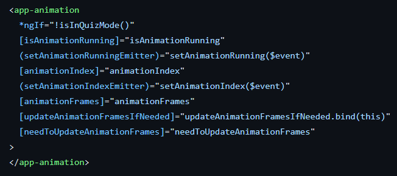

## AI Search Algorithm Visualisation

Hello! This is the documentation detailing the codebase of this project. For learning how to use the app, checkout the tutorial section that displays when you enter it.

## Brief Overview Of Project

This project implements interactive visualisers for algorithms that solve three broad classes of AI problems – graph search, constraint satisfaction and adversarial search. This tool is designed to help students of AI understand the algorithms better, aiding the learning process. Graph search is visualised through applying it to a 2D grid. Constraint satisfaction is visualised through applying it to the N-Queens problem, which involves placing N queens on a N x N chessboard such that no two queens are attacking each other. Adversarial search visualises the minimax algorithm through an abstract tree diagram similar to what you'd see in a standard AI textbook.

## General architecture - Modules

This project uses the Angular module system. Each class of algorithm visualised has its own module, and there is a module for components that are shared between the other three.

Each algorithm module has its own route, organised using Angular router. Routes are handled by having a router outlet in the app folder, and a routing-module file for each algorithm module. To add a new route, a maintainer would simply have to generate a routing module by running:

`ng generate module "module-name" --routing`

and then generate an entry component by running

`ng component "module-name"/"component-name"`

which would place the component in the newly created modules folder. They would then have to set up the routes in the routing-module file of the newly created module, routing their URL of choice to the new component they have created. An example of how to do this can be found in any of the routing-module files for the algorithm modules.

## General architecture - Dropdowns

To made adding new options easy, options for the UI are driven by dropdowns. This also helps keeps the UI consistent, making it easy for the user to find what they need by scanning through the menu. There is a dropdown component in the shared module that takes several arguments. The first argument is a list of strings that correspond to items in the dropdown menu, where each string is the option the user can see. The second argument is the current item being displayed, which should be tied to a piece of state in the parent component. This should also be a member of the list of strings. For each tool, this is conventionally done by creating an enum for each dropdown menu. These enums are typically contained in their own file, and map onto the strings that will render for the options on the screen.

There is a piece of state in the parent component for each enum.

The current value of that state is passed in to the dropdown component so it knows what is currently selected. The list of strings is passed in by saving an invariant instance variable that is assigned to Object.value(Enum), which enumerates the possible string displays.

The dropdown menu also takes a callback for notifying the parent component that the item has been updated, and some commentary that displays when an item is hovered over. The image below shows how to put this all together to render a dropdown in the markup side of an Angular component.

## General architecture - Animations

Animations are done through rendering an animation component in the shared module and passing the appropiate arguments in. This allows someone creating a new visualiser to get animations working with very little code, although it's not perfect and a bit of boilerplate is needed. The animations are designed to support lazy computation by default. This is where animations aren't computed until the user changes the animation frame they're doing. The purpose of this is to stop the browser lagging when the user makes rapid changes to the problem state.

The arguments isAnimationRunning, animationIndex and animationFrames should be defined as state in the parent component. The variable isAnimationRunning will be useful in the parent component for doing conditional rendering depending on whether the animation is running. The methods setAnimationRunning() and setAnimationIndex() should be simple setters for allowing the animation component to update the values of isAnimationRunning and animationIndex. The reason updateAnimationFramesIfNeeded() isn't done through an event emitter like the other two is because it doesn't pass any parameters back up; it just gives the parent component a notification that the frames might need to be updated. This should be an implementation of updating the animation frames, as it's called whenever the user changes state in the application. When using lazy loading, the user should have a boolean flag that's set to true whenever some state changes and only does the computation if this flag is true.
